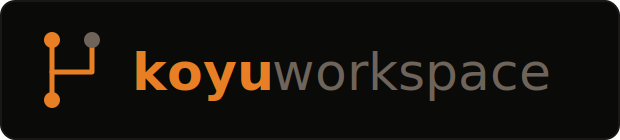

<p align="center">
  
</p>

<p align="center">
  <a href="https://discord.gg/SkEJNJ9NJ"></a>
  <a href="https://koyu.dev/docs"></a>
</p>

# koyu-workspace

koyu-workspace is the bookkeeping half of [koyu](https://koyu.dev), an open
platform for robot learning. It stores your robot learning experiments
locally, ingests datasets from your robot, manages the provenance that
links the two, and synchronizes all of it to koyu.dev.

Like the runtime, the workspace is an agentically driven tool. Agents work
it through the `koyu` CLI and a local HTTP API: creating projects and runs,
linking manifests (koyu's name for datasets), ingesting recordings, and
syncing to the cloud. A frontend ships along for visualizing data and
keeping track of projects, and as with the runtime, you are expected to
modify it significantly.

Two seams matter most for how the workspace connects to the rest of koyu.
On the runtime side it is the episode bundle format, which the ingester
sweeps from the runtime's outbox into the store. On the cloud side it is
the schema of projects, runs, manifests, and episodes, mirrored at
koyu.dev.

## The data model

Projects are containers for runs, and each run records one robot learning
experiment. Both projects and runs carry files. Runs link to manifests, and
a manifest is an ordered collection of episodes. Runs are stored as a tree,
which lets the workspace represent experiments the way they actually
unfold: iteratively, with branches that spread sideways.

## Getting started

```bash
git clone https://github.com/vdesai2014/koyu-workspace
cd koyu-workspace
pip install -e .
```

Start the store's server, then the frontend:

```bash
KOYU_HOME=~/my-workspace LOCAL_TOOL_PORT=8000 uvicorn local_tool.server.app:app --port 8000
cd frontend && npm install && npx vite
```

The workspace plugs its verbs into the `koyu` command from
[koyu-cli](https://pypi.org/project/koyu-cli/): `koyu ingest` sweeps a
runtime's outbox into the store, `koyu clone` pulls a public project down
from koyu.dev, and `koyu sync-push` / `koyu sync-pull` move your entities
between the store and the cloud.

## Documentation

| doc | for | question it answers |
|---|---|---|
| [AGENTS.md](AGENTS.md) | coding agents | how do I do X safely? (the manual) |
| [KNOWN-ISSUES.md](KNOWN-ISSUES.md) | everyone | what do we know is rough? |
| [koyu.dev/docs](https://koyu.dev/docs) | platform-wide | how does it all fit together? |

## Contributing

The best way to contribute right now is through the
[Discord](https://discord.gg/SkEJNJ9NJ): architecture questions, design
arguments, and bug reports all welcome. Pull requests stay closed while the
codebase is moving this fast.

## Status

koyu as a whole is in alpha. [KNOWN-ISSUES.md](KNOWN-ISSUES.md) lists what
we know is rough today, and the coming months are for addressing it.
